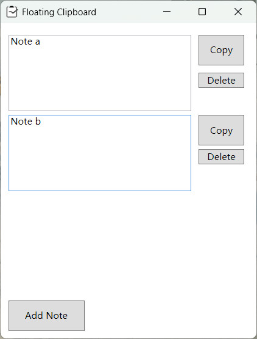

# Floating Clipboard

A simple clipboard application that can float on the screen and supports multiple clipboards. This is a top-positioned window designed for quick copying of text in different text boxes.

Developed using the .NET 8.0 framework and compiled using Visual Studio 2022.

## How to Run

Firstly, install the [**.NET 8.0 Desktop Runtime**](https://dotnet.microsoft.com/en-us/download/dotnet/8.0) framework, **version 8.0.13 or later**. Note that the x64 version of the runtime may not be x86 compatible.

And then, download `.exe` in [releases](https://github.com/Hsiao-Feng/Floating-Clipboard/releases). Put it in the appropriate folder and run it directly. Please note that the notes when program closed will be stored in json file in the same directory.

## Screenshot

